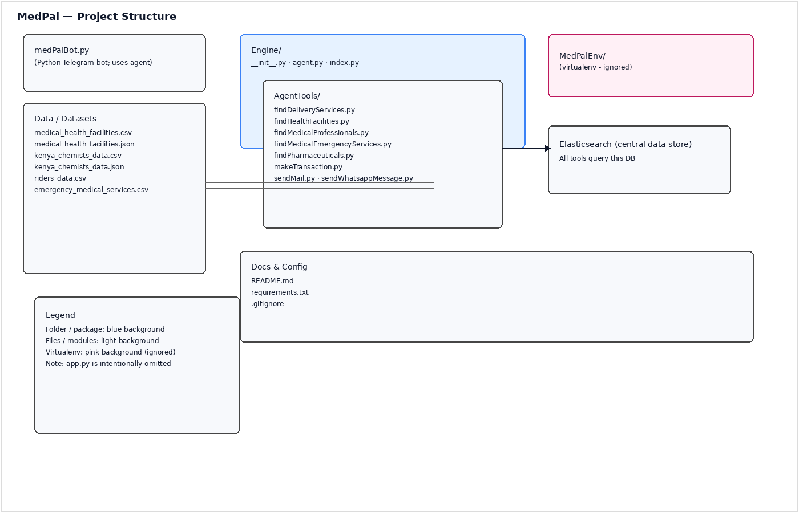

# MedPal

**MedPal** is your personal health assistant, designed to help you manage your medications, appointments, and health records with ease. Never miss a dose or an appointment again!

## Table of Contents

- [Features](#features)
- [Getting Started](#getting-started)
  - [Prerequisites](#prerequisites)
  - [Installation](#installation)
- [Usage](#usage)
- [Contributing](#contributing)
- [License](#license)

## Features

- **Medication Management**: Track your medications, set reminders for doses, and log when you've taken them.
- **Appointment Scheduling**: Keep all your doctor's appointments in one place with timely reminders.
- **Health Records**: Securely store and access your important health information and documents.
- **Symptom Tracker**: Log symptoms over time to provide a clear history for your healthcare provider.
- **User-friendly Interface**: A clean and intuitive design for easy navigation.

## Getting Started

Follow these instructions to get a copy of the project up and running on your local machine for development and testing purposes.

### Prerequisites

- [Python 3.8+](https://www.python.org/downloads/)
- [pip](https://pip.pypa.io/en/stable/installation/) (Python package installer)

### Installation

1. **Clone the repository:**

    ```bash
    git clone https://github.com/kephothoXMedPal.git
    cd MedPal
    ```

2. **Create and activate a virtual environment:**

    *On macOS and Linux:*

    ```bash
    python3 -m venv MedPalEnv
    source env/bin/activate
    ```

    *On Windows:*

    ```bash
    python -m venv MedPalEnv
    .\env\Scripts\activate
    ```

3. **Install the required dependencies:**
    (You should create a `requirements.txt` file with all project dependencies)

    ```bash
    pip install -r requirements.txt
    ```

## Usage

Once the installation is complete, you can run the application.

```bash
python adk web
```

Open your web browser and navigate to `http://127.0.0.1:8000` to use MedPal.

To Start Telegram Bot run `python medPalBot.py`

## Contributing

Contributions are what make the open-source community such an amazing place to learn, inspire, and create. Any contributions you make are **greatly appreciated**. Please refer to the `CONTRIBUTING.md` file for details on our code of conduct, and the process for submitting pull requests to us.

## License

This project is licensed under the MIT License - see the `LICENSE` file for details.

## Datasets

I used `.csv` files for development test datasets all generated using AI.

## Project Structure

Below is a visual overview of the main project layout. The diagram excludes `app.py` and shows that most runtime tools query the central Elasticsearch datastore.



## Replace this .ENV vaiables with your own

```

ELASTIC_SEARCH_URL=<https://my-elasticsearch-project-ec5919.es.us-central1.gcp.elastic.cloud:443>
GOOGLE_GENAI_USE_VERTEXAI=FALSE
GOOGLE_API_KEY=
GOOGLE_MAPS_API_KEY=
MEDPALBOT_TOKEN=
MEDPAL_API_KEY= (Your Elastic Search API Key)
DEV_EMAIL=
DEV_EMAIL_APP_PASSWORD=
TWILIO_AUTH_TOKEN=
TWILIO_ACCOUNT_SID=
PRIVATE_KEY=0xd8a0d9893f1432b64ed9947a7c54787702269396a90d27d9b5123a06810f67d6
ACCOUNT=0x93D85e536F81D49B781E317cd516C020f6d4363C
INFURA_API_KEY=
INFURA_ENDPOINT=<https://mainnet.infura.io/v3/>

```
